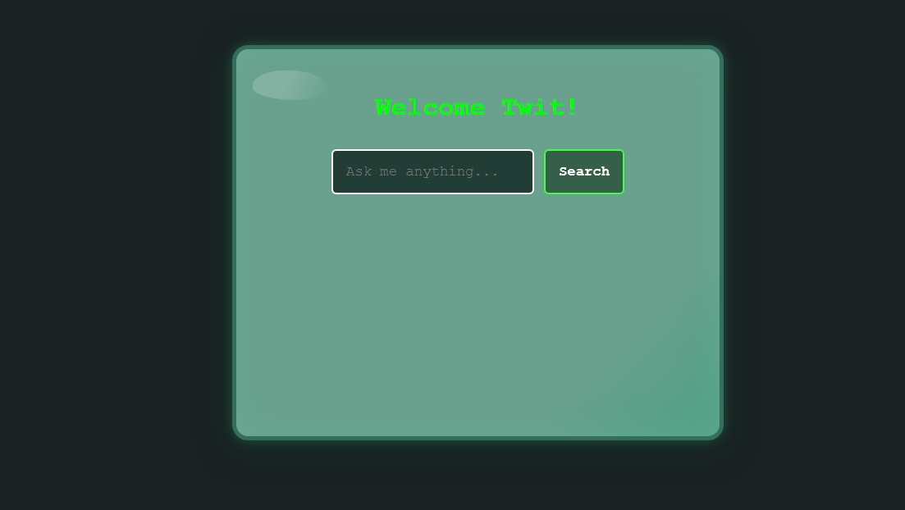

# Courage Computer (Cartoon Terminal Chatbot)

A web-based, retro-inspired chatbot in the style of Courage the Cowardly Dog’s iconic computer!  
Features a CRT green “glass” screen, typewriter animation, sarcastic AI answers (powered by Gemini), and a nostalgic terminal feel.




---

## 🖥 Features

- **Nostalgic Design:** CRT screen, teal/green glass effect, classic terminal colors
- **Typewriter Animation:** Answers appear letter by letter for retro flair
- **Sassy, Sarcastic AI:** Answers are factual *and* in-character
- **Responsive:** Looks great on mobile and desktop

---

## 🛠️ Tech Stack

- React
- Node.js Proxy for Gemini API
- CSS (no UI libraries)

---

## ⚡ Getting Started

**Clone and run locally:**
```bash
git clone https://github.com/shand-webdev/courage_computer.git
cd courage_computer
npm install
npm start
